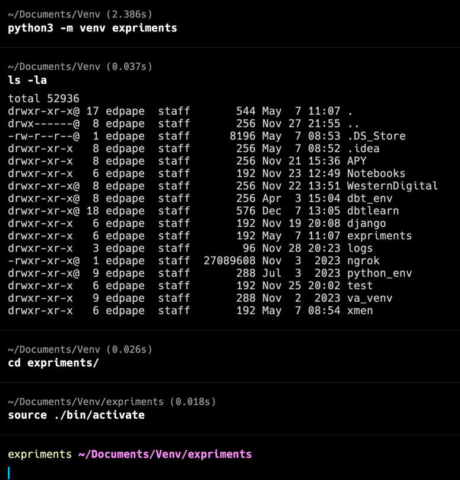

# Description

There are 2 scripts as a POC. 
-   main.py --> Is a basic web scrapping to the web page: "forumcph.dk"
-   ticket.py --> Using ticketmaster API to get the events in denmark in the month of July as an example

# How to run 

1. Check if python is installed. Open a terminal and type: 
> python --version
> 
> or
> 
> python3 --version

If there is no result you can install for the official web page.
And the version should be >3.10 if not update.

> https://www.python.org/downloads/

2. Once python is installed we need to create a new virtual environment for the project 

> - Create a folder where to store the virtual environment
> - Open a terminal and move to the folder previous created and execute the following
> - python -m venv <name_of_the_venv> or python3 -m venv <name_of_the_venv>
> - Example: python3 -m venv expriments

Once the environment is created, we need to activate.

> In the terminal navigate to the folder created by the previous command and execute:
> 
> source ./bin/activate

3. Copy the project to the local machine
4. Now we have the venv installed and active, we need to install the needed packages. 
With the venv active in the terminal move to the project and execute the following:

> pip install -r requirements

5. And then run the 2 scripts to see the results:

> python3 main.py
> 
> python3 ticket.py
>

# THE END
    
