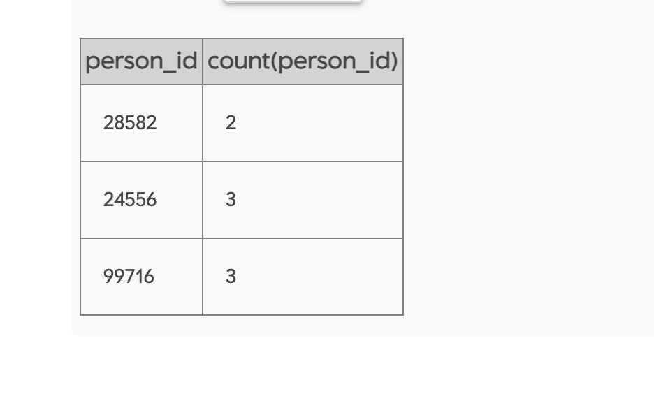

-- Queries

SELECT \*
FROM crime_scene_report
WHERE type = 'murder' and city = 'SQL City'
Order by city;

SELECT \*
FROM person
where address_street_name = 'Franklin Ave'
And name like 'Annabel %'

SELECT \*
FROM drivers_license
where id = 490173

SELECT \*
FROM interview
where person_id = 16371

SELECT \*
FROM person
where address_street_name = 'Northwestern Dr'
order by address_number desc

SELECT \*
FROM person a
INNER JOIN interview b on a.id = b.person_id
where id = 14887

SELECT \*
FROM get_fit_now_check_in a
INNER JOIN get_fit_now_member b on a.membership_id = b.id
INNER JOIN person c on c.id = b.person_id
where check_in_date like '20180109'
and membership_status = 'gold'
and membership_id like '48Z%';

SELECT \*
FROM person a
INNER JOIN interview b ON a.id = b.person_id
where id in (28819,67318)

SELECT \*
FROM drivers_license
where car_make = 'Tesla' and car_model = 'Model S'
and hair_color = 'red' and (height = '65' or height = '67')

SELECT \*
FROM person a
where license_id = '918773'

SELECT person_id,
count(person_id)
FROM facebook_event_checkin
where event_name like '%Symphony%' and date like '201712%'
group by person_id
having count(person_id) > 1
order by date

SELECT \*
FROM person a  
INNER JOIN drivers_license b on a.license_id = b.id
where a.id in (24556, 99716)

